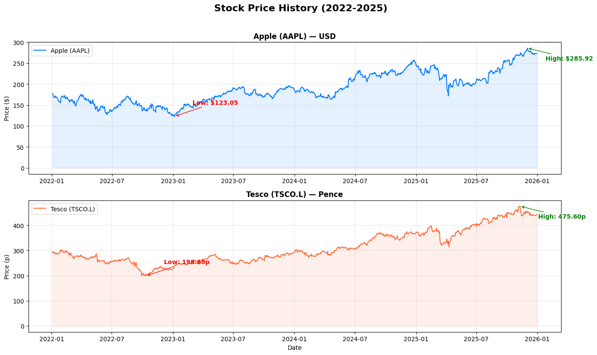
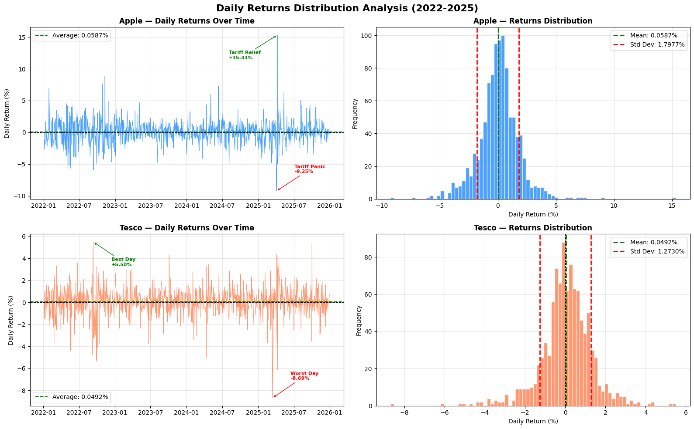
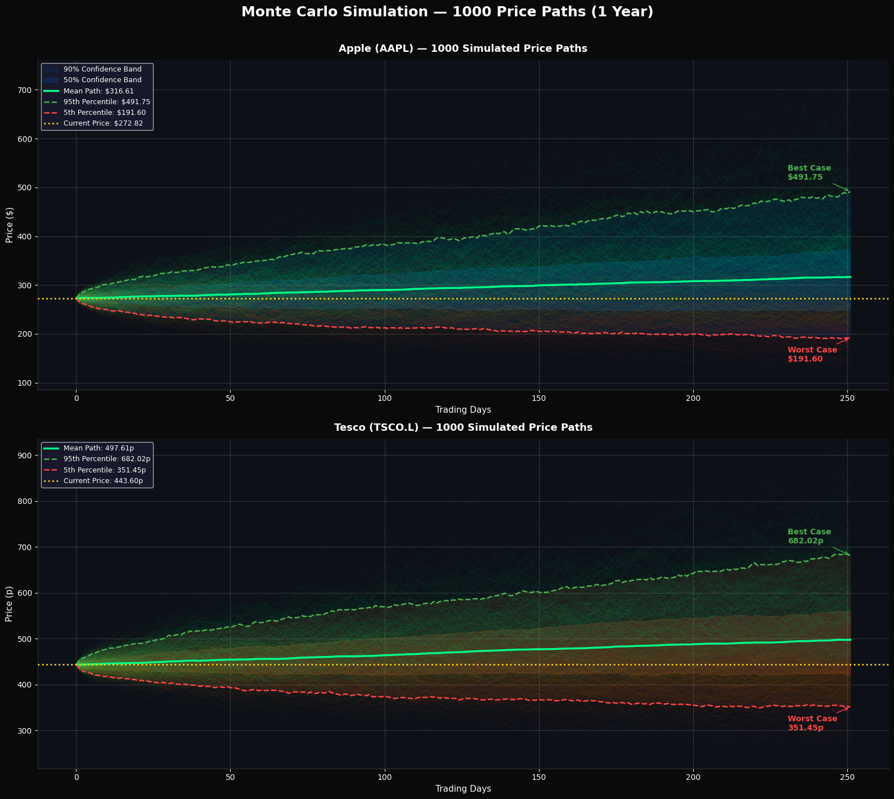
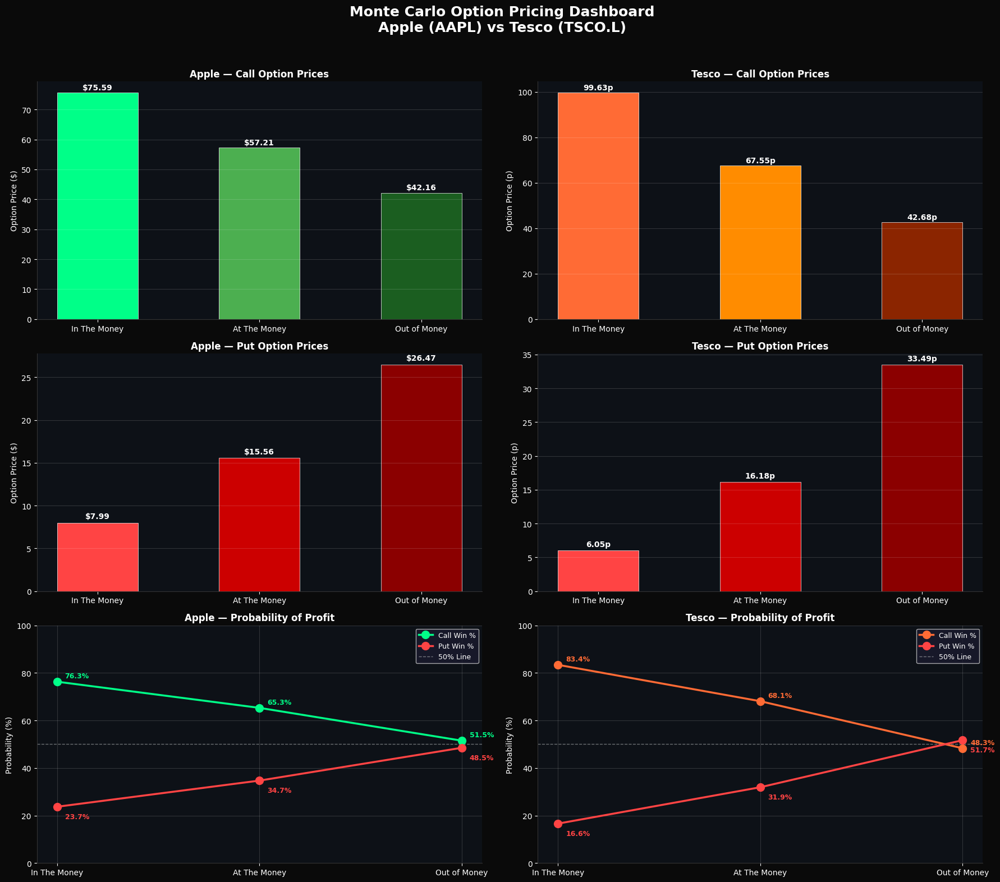

# 📈 Monte Carlo Option Pricing Simulator
### Apple (AAPL) vs Tesco (TSCO.L) — Cross Market Comparison

---

## 📌 Project Overview

This project builds a **Monte Carlo Option Pricing Simulator** using 
real historical stock market data. Rather than using assumed theoretical 
values, the simulator downloads 3 years of actual market data, calculates 
real volatility and drift, simulates **1,000 possible future price paths** 
for each stock, and uses those simulations to price Call and Put options.

### Why These Two Stocks?
| Stock | Market | Sector | Volatility |
|-------|--------|--------|-----------|
| Apple (AAPL) | NASDAQ — US | Technology | 28.54% |
| Tesco (TSCO.L) | LSE — UK | Retail / Consumer Staples | 20.21% |

Comparing a **US tech stock** against a **UK retail stock** demonstrates 
how volatility differences across markets and sectors directly affect 
option pricing — a key concept in real world financial analysis.

---

## 🚀 Key Results

### Monte Carlo Simulation (1 Year Forecast)
| Metric | Apple (AAPL) | Tesco (TSCO.L) |
|--------|-------------|-----------------|
| Current Price | $272.82 | 443.60p |
| Mean Predicted Price | $316.61 (+16%) | 497.61p (+12%) |
| Best Case (95th Percentile) | $491.75 (+80%) | 682.02p (+54%) |
| Worst Case (5th Percentile) | $191.60 (−30%) | 351.45p (−21%) |
| Annual Volatility | 28.54% | 20.21% |

### Option Pricing Results
| Option Type | Apple Price | Apple Win% | Tesco Price | Tesco Win% |
|-------------|------------|------------|-------------|------------|
| ITM Call | $75.59 | 76.3% | 99.63p | 83.4% |
| ATM Call | $57.21 | 65.3% | 67.55p | 68.1% |
| OTM Call | $42.16 | 51.5% | 42.68p | 48.3% |
| ITM Put | $7.99 | 23.7% | 6.05p | 16.6% |
| ATM Put | $15.56 | 34.7% | 16.18p | 31.9% |
| OTM Put | $26.47 | 48.5% | 33.49p | 51.7% |

---

## 📊 Project Visualisations

### Stock Price History (2022–2025)

### Daily Returns Distribution

### Monte Carlo Simulation — 1000 Price Paths

### Option Pricing Dashboard

---

## 🗂️ Project Structure
